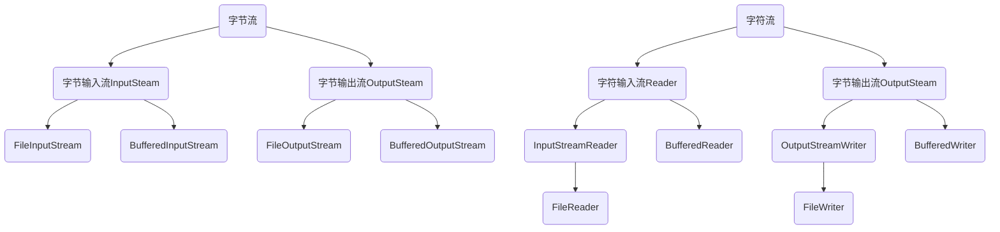

# 一、修饰符

## 权限修饰符

    private、default、protected、public


## 状态修饰符

    **final**关键字是最终的意思，可以修饰成员方法、成员变量、类，即不可以被重写。

    **static** 静态，可以修饰成员方法、成员变量。如修饰类成员变量，即可被所有对象共享

# 二、多态

## 1.概念

    同一个对象，在不同时刻表现出来的不同形态。 eg： ```Animal animal = new cat();```

    多态的前提和体现：

        有继承/实现关系；

        有方法重写；

        有父类引用子类对象。

## 2.多态中成员访问特点

    ```Animal animal = new cat();```

    成员变量：编译看左边，运行看左边

    成员方法：编译看左边，运行看右边

    区别之处：成员方法有重写，成员变量没有。

# 三、抽象类

## 1.概述

    在JAVA中，一个没有方法体的方法应该定义为抽象方法，而类中如果有抽象方法，该类必须定义为抽象类。

## 2.抽象类的成员特点

    成员变量：可以是常量，也可以是变量；

    构造方法：有构造方法，子类可以访问父类数据的初始化；

    成员方法：可以有抽象方法也可以有非抽象方法。

# 四、接口

## 1.抽象类与接口的区别


## 2.接口名作为形参和返回值

1.方法的形参是接口名，其实是需要传入该接口的实现类对象；

2.方法的返回值是接口名，其实是返回的该接口的实现类对象。

# 五、内部类

## 1.内部类概述

内部类：就是再一个类中定义一个类。

内部类的定义格式：

```java
public class Outer{
    public class Inner{

    }
}
```

内部类的访问特点：

1.内部类可以直接访问外部类的成员，包括私有；

2.而外部类要访问内部类的成员，必须创建对象。

## 2.成员内部类

按照内部类在类中定义的位置不同可以分为如下两种形式：

- 在类的成员位置：成员内部类

- 在类的局部位置：局部内部类

成员内部类，外界如何创建对象调用：

- 格式：外部类名.内部类名 对象名 = 外部类对象.内部类对象;

- 示例：

```java
Outer.Inner oi = new Outer().new Inter();
```

## 3.局部内部类

### 3.1局部内部类

        局部内部类是在方法中定义的类，所以外界是无法直接使用的，需要在方法内部创建对象并使用。该类可以直接访问外部类的成员，也可以访问方法内的局部变量。

示例：

```java
public class Outer {
    private int num = 10;

    public void method(){
        int num2 = 20;
        class Inner{
            public void show(){
                System.out.println(num);
                System.out.println(num2);
            }
        }

        Inner i = new Inner();
        i.show();
    }
}
```

### 3.2.匿名内部类

前提：存在一个类或者接口，这里的类可以是具体类也可以是抽象类。

本质：是一个继承了该类或者实现了该接口的子类匿名对象。

格式：

```java
new 类名或接口名(){
    重写方法;
}
```

实例：

```java
/*    一个接口    */
public interface Inter{
    void show();
}

/*    实现匿名内部类*/
public class Outer{
    public void method(){
        Inter i = new Inter(){
            @Override
            public void show(){
                System.out.println("匿名内部类");
            }
        };
        i.show();
    }
}
```

### 3.3 匿名内部类在开发中的使用

实例：

```java
// Jumpping接口
public interface jumpping{
    void jump();
}

// 接口操作类，里面有一个方法，方法的参数是接口
public class JumppingOperator{
    public void method(Jumpping j){
        j.jump();
    }
}

// 测试类
public class JumppingDemo{
    public static void main(String[] args){
        JumppingOperator jo = new JumppingOperator();
        jo.method(new Jumpping(){
            @Override
            public void jump(){
                跳跃;
            }
        });
    }
}
```

# 六、常用API

## 1.Math

常用方法：


## 2.System

常用方法


## 3.Object

    Object是类层次结构的根，每个类都可以将Object作为超类。所有类都直接或者间接的继承自该类。

常用方法：


## 4.基本类型包装类


## 5.DATE


## 6.SimpleDateFormat

        SimpleDateFormat是一个具体的类，用于以区域设置敏感的方式格式化和解析日期。

        日期和时间格式由日期和时间模式字符串指定，在日期和时间模式字符串中，从A到Z以及从a到z的字母被解释为表示日期或时间字符串的组件的模式字母

- y 年

- M 月

- d 日

- H 时

- m 分

- s 秒


SimpleDateFormat格式化和解析日期

- public final String format(Date date) ：将日期格式化为日期/时间字符串

- public Date parse(Stirng source)：从给定字符串的开始解析文本以生成日期

# 七、异常

## 1.异常概述

        异常：程序出现不正常情况。

        异常体系：


## 2. 异常处理（try...catch）

格式：

```java
try{
    可能出现异常的代码;
} catch(异常类名 变量名){
    异常的处理代码;
}
```

执行流程：

程序从try里面的代码开始执行；

出现异常，会自动生成一个异常类对象，该异常对象将被提交给JAVA运行时系统；

当JAVA运行时系统接收到异常对象时，会到catch中去找匹配的异常类，找到后进行异常的处理；

执行完毕后，程序还可以继续往下执行。

## 3.Throwable的成员方法


## 4.异常处理（throws）

        不是所有异常都有权限处理，对此JAVA提供了throws的处理方案。

格式:

```java
        throws 异常类名;
//  注意：这个格式是跟在方法的括号后面的
```

## 5.自定义异常

格式：

```java
public class 异常类名 extends Exception {
        无参构造；
        带参构造；
}
// 
```

# 八、集合

## 1.集合类体系结构


## 2.Collection集合概述和使用

Collection集合概述：

- 是单例集合的顶层接口，它表示一组对象，这些对象也称Collection的元素

- JDK不提供此接口的任何直接实现，它提供更具体的子接口（如Set和List）实现

创建Collection对象：

- 多态

- 具体的实现类ArrayList

```java
// 创建Collection集合的对象
Collection<String> c = new ArrayList<String>();
// 添加元素
c.add("hello,world");
```

常用方法：


## 3.Collection集合的遍历

Iterator：迭代器，集合的专用遍历方式。

- Iterator<E> iterator(): 返回此集合中元素的迭代器，通过集合的iterator()方法得到
- 迭代器是通过集合的iterator()方法得到的，所以我们说他是依赖于集合而存在的

Iterator中的常用方法

- E next()：返回迭代中的下一个元素
- boolean hasNext()：如果迭代具有更多元素，则返回true。

用法：

```java
Collection<String> c = new ArrayList<String>();
Iterator<String> it = c.iterator();
while(it.hasNext){
    String s = it.next();
    System.out.println(s);
}
```

## 4.List集合概述和特点

概述：

- 有序集合（序列），用户可以精确控制列表中每个元素的插入位置。用户可以通过整数索引访问元素，并搜索列表中的元素。
- 与Set集合不同，列表通常允许重复

创建：

```java
List<String> list = new ArrayList<String>();
```

方法：


## 5.增强for循环

增强for：简化数组和Collection集合的遍历

- 实现Iterator接口的类允许其对象成为增强型for语句的目标
- 它是JDK5之后出现的，其内部原理是一个Iterator迭代器(即可能发生并发修改异常)

格式：

```java
for(元素数据类型 变量名:数组或Collection集合){
    操作;
}
// eg
int[] arr = {1,2,3,4,5};
for(int i : arr){
    sout(i);
}
```

## 6.List集合子类特点

List集合常用子类：ArrayList、LinkedList

- ArrayList：底层数据结构是数组，查询快增删慢；
- LinkedList：链表，查询慢，增删快。

## 7.LinkedList集合的特有功能


## 8.set集合

### 8.1set集合概述

set集合特点：不包含重复元素，没有带索引的方法（不能用for）

HashSet：对集合的迭代顺序不做任何保证。

```java
Set<String> set = new HashSet<String>();
```

### 8.2哈希值

哈希值：是JDK根据对象的地址或者字符串或者数字算出来的int类型的数值

Object类中有个方法可以获取对象的哈希值。

- public int hashCode(); 返回对象的哈希码值

对象的哈希值的特点：

- 同一个对象多次调用hashCode()方法返回的哈希值是相同的；
- 默认情况下，不同对象的哈希值是不同的。而重写hashCode()方法，可以实现让不同对象的哈希值相同。

### 8.3hashSes集合概述

特点：

- 底层数据结构是哈希表
- 对集合的迭代顺序不保证
- 没有索引，不能用for
- 不包含重复元素

## 9.LinkHashSet集合概述和特点

特点：

- 哈希表和链表实现的Set接口，具有可预测的迭代次序；
- 由链表保证元素有序，也就是说元素的存储和取出顺序是一致的；
- 由哈希表保证元素唯一

## 10.泛型

### 10.1泛型概述

概述：

​        泛型是JDK5中引入的特性，它提供了编译时类型安全检测机制，该机制允许在编译时检测到非法的类型。

​        它的本质是参数化类型，也就是说所操作的数据类型被指定为一个参数。将类型由原来的具体的类型参数化，然后在使用/调用时传入具体的类型。

​        这种参数类型可以用在类、方法和接口中。

泛型定义格式：

- <类型>：指定一种类型的格式。这里的类型可以看成是形参；
- <类型1，类型2，...>：指定多种类型的格式。这里的类型可以看成是形参；
- 将来具体调用时候给定的类型可以看成是实参，并且实参的类型只能是引用数据类型。

好处：

- 把运行时期的问题提前到了编译期间。
- 避免强制类型转换。

### 10.2泛型类

定义格式：

- 格式：修饰符 class 类名 <类型> {}
- 范例：public class Generic<T> {}   注意：此处T可以随意写为任何标识

实例：

```java
public class Generic<T> {
    private T t;

    public T getT(){
        return t;
    }
    public void setT(T t){
        this.t = t;
    }
}
```

### 10.3泛型方法

定义格式：

- 格式：修饰符 <类型> 返回值类型 方法名(类型 变量名){}
- 范例：public <T> void show (T t){}

实例：

```java
public class Generic {
    public <t> void show (T t){
        sout();
    }
}
```

### 10.4泛型接口

定义格式：

- 格式：修饰符 interface 接口名<类型>{}
- 范例：public  interface Generic <T>{}

实例：

```
// 泛型接口
public interface Generic <T>{
    void show(T t);
}
// 实现类
public class GenericImpl<T> implements Generic<T> {
    @Override
    public void show(T t){
        sout(t);
    }
}
```

### 10.5类型通配符

为了表示各种泛型list的父类，可以使用类型通配符

- 类型通配符：<?>
- List<?>：表示元素类型未知的list，它的元素可以匹配任何类型
- 这种带通配符的List仅表示它是各种泛型List的父类，并不能将元素添加进其中

如果说我们不希望List<?>是任何泛型List的父类，只希望它代表某一类泛型List的父类，可以使用类型通配符的上限

- 类型通配符上限：<? extends 类型>

- List<? extends Number>：它表示的类型是Number或者其子类型

- 类型通配符下限：<? super 类型>

- List<? extends Number>：它表示的类型是Number或者其父类型
  
  ### 10.6可变参数

概述：可变参数又称参数个数可变，用作方法的形参出现，那么方法的参数个数就是可变的了。

- 格式：修饰符 返回值类型 方法名 （数据类型 ... 变量名）{}
- 范例：public static int sum(int... a){}

注意事项：

- 这里的变量其实是一个数组
- 如果一个方法有多个参数，包含可变参数，可变参数要放在最后

使用：

Arrays工具类中有一个静态方法：

- public static <T> List<T> asList(T... a):返回由指定数组支持的固定大小的列表
- 返回的集合不能增删，但是可以修改

List接口中有一个静态方法：

- public static <E> List<E> of(E... element):返回包含任意数量元素的不可变列表
- 返回的集合不能做增删改

Set接口中有一个静态方法：

- public static <E> Set<E> of (E... element): 返回一个包含任意数量元素的不可变集合
- 不能有重复元素
- 返回的集合不能做增删，且没有改的方法

## 11.Map集合

概述：

- interface Map <K,V>    K：键类型，V：值类型
- 将键映射到值的对象；不能包含重复的键；每个键最多映射一个值

创建Map集合的对象：

- 多态的方式
- 具体的实现类HashMap

常用方法：


## 12.Collections集合

概述：

- Collections类是针对集合操作的工具类

常用方法：

- public static <T extends Comparable<? super T>> void sort (List<T> list)：升序排序
- public static void reserve (List<T> list)：反转顺序
- public static void shuffle (List<T> list)：使用随机源进行随机排序

实例：ArrayList存储学生对象并排序


## 

实现：

```java
public static void main(String[] args){
    ArrayList<Student> array = new ArrayList<Student>();
    Student s1 = new Student("张三",30);
    Student s2 = new Student("李四",35);
    Student s3 = new Student("王五",33);
    Student s4 = new Student("赵六",33);
    array.add(s1);
    array.add(s2);
    array.add(s3);
    array.add(s4);

    Collections.sort(array, new Comparable<Student>() {
        @Override
        public int compare(Student s1, Student s2){
            int num = s1.getAge()-s2.getAge();
            int num2 = num==0 ? s1.getName().compareTo(s2.getName()) : num;
            return num2;
        }
    });
}
```

## 13.排序

### 13.1自然排序Comparable的使用

使用：

- 用TreeSet集合存储自定义对象，无参构造方法使用的是自然排序对元素进行排序
- 自然排序，就是让元素所属的类实现Comparable接口，重写comparaTo(T o)方法
- 重写方法时，一定要注意排序规则必须要按照要求的主要条件和次要条件来写

范例：

```java
public class Student implements Comparable<Student> {
    @Override
    public int comparaTo(Student s) {
        return 0; //说明元素重复
        return 1; //说明将要存储的比原本的大，排在下面
        return -1; //说明将要存储的比原本的小，排在上面
        // 按照年龄从小到大排序；
        return this.age - s.age;
        // 年龄从小到大，年龄相同则比较名字
        int num = this.age-s.getAge();
        int num2 = num==0 ? this.name.compareTo(s.getName()) : num;
        return num2;
    }
}
```

### 13.2比较器排序Comparator的使用

使用：

- 用TreeSet集合存储自定义对象，带参构造方法使用的是比较器排序对元素进行排序
- 比较器排序，就是让集合构造接收Comparator的实现类对象，重写compara(T o1, T o2)方法
- 重写方法时，一定要注意排序规则必须要按照要求的主要条件和次要条件来写

范例：

```java
Collections.sort(array, new Comparable<Student>() {
        @Override
        public int compare(Student s1, Student s2){
            int num = s1.getAge()-s2.getAge();
            int num2 = num==0 ? s1.getName().compareTo(s2.getName()) : num;
            return num2;
        }
    });
```

# 九、IO流

## 1.File

### 1.1FIle类概述和构造方法

File：它是文件和目录路径名的抽象表示

- 文件和目录是可以通过File类封装成对象的
- 对于File而言，其封装的并不是一个真正的文件，仅仅是一个路径名而已。它可以使存在的，也可以是不存在的。可以通过具体的操作把这个路径的内容转换为具体的存在。

构造方法：


```java
public static void main(String[] args) {
    File f1 = new File("H:\\JavaLearning\\JAVAEE\\IOLearning\\java.txt");
    System.out.println(f1);
    File f2 = new File("H:\\JavaLearning\\JAVAEE","IOLearning\\java.txt");
    System.out.println(f2);
    File f3_1 = new File("H:\\JavaLearning\\JAVAEE");
    File f3 = new File(f3_1,"IOLearning\\java.txt");
    System.out.println(f3);
}
```

### 1.2File类的创建功能


```java
public static void main(String[] args) throws IOException {
    String dir1 = "H:\\JavaLearning\\JAVAEE\\IOLearning\\java.txt";
    String dir2 = "H:\\JavaLearning\\JAVAEE\\IOLearning";
    String dir3 = "H:\\JavaLearning\\JAVAEE\\IOLearning\\mkdir.txt";
    File f1 = new File(dir1);
    System.out.println(f1.createNewFile());// 文件不存在则创建，返回true；反之不创建，返回false

    File f2 = new File(dir2+"\\MkdirTest");
    System.out.println(f2.mkdir());

    File f3 = new File(dir2+"\\MkdirsTest\\MkdirsTest");
    System.out.println(f3.mkdirs());

    /**
         * 不能个根据路径名判断是文件还是目录
         * 尽管是个txt文件的路径，但是使用mkdir还是会创建目录
         */
    File f4 = new File(dir3);
    System.out.println(f4.mkdir());
}
```

### 1.3File类的删除功能


```java
public static void main(String[] args) throws IOException {
    String dir = "H:\\JavaLearning\\JAVAEE\\IOLearning\\delete.txt";
    File f1 = new File(dir);
    System.out.println(f1.createNewFile());
    System.out.println(f1.delete());
}
```

注意事项：

- 如果一个目录中有内容，不能直接删除，应该先删除该目录下的内容。

### 1.4File类的判断和获取功能


```java
public static void main(String[] args) {
    String dir1 = "H:\\JavaLearning\\JAVAEE\\IOLearning";
    File f1 = new File(dir1);
    for (String str : f1.list()){
        System.out.println(str);
    }

    for (File file : f1.listFiles()){
        System.out.println(file.getName());
    }
}
```

## 2.字节流

### 2.1IO流概述和分类

IO流概述：

- IO：输入输出
- 流：是一种抽象概念，是对数据传输的总称。也就是说在设备间的传输成为流，流的本质是数据传输。
- IO流就是用来处理设备间数据传输问题的：文件赋值、文件上传、文件下载

### 2.2字节流写数据

字节流抽象基类：

- InputStream：这个抽象类是表示字节输入流的所有类的超类
- OutputStream：这个抽象类是表示字节输出流的所有类的超类
- 子类名特点：子类名称都是以其父类名作为后缀

FileOutputStream：文件输出流，用于将数据写入file

- FileOutputStream(String name)：创建文件输出流，以指定的名称写入文件

```java
public static void main(String[] args) throws IOException {
    String dir1 = "H:\\JavaLearning\\JAVAEE\\IOLearning\\java.txt";
    /**
         * 做的事情：
         * 1.调用系统功能创建文件；
         * 2.创建字节输出流对象；
         * 3.字节输出流对象指向创建好的文件。
         */
    FileOutputStream fileOutputStream = new FileOutputStream("fos.txt");
    fileOutputStream.write(97);

    fileOutputStream.close();
}
```

### 2.3字节流写数据的三种方式


```java
public static void main(String[] args) throws IOException {
    String dir1 = "H:\\JavaLearning\\JAVAEE\\IOLearning\\java.txt";
    FileOutputStream fileOutputStream = new FileOutputStream("fos.txt");

    byte[] bytes = "abcde".getBytes();
    fileOutputStream.write(bytes);

    fileOutputStream.write(bytes,1,3);

    fileOutputStream.close();

}
```

### 2.4字节流写数据的两个问题

- 如何换行

```java
public static void main(String[] args) throws IOException {
    String dir1 = "H:\\JavaLearning\\JAVAEE\\IOLearning\\java.txt";
    FileOutputStream fileOutputStream = new FileOutputStream("fos.txt");

    for(int i=0;i<10;i++){
        fileOutputStream.write("hello".getBytes());
        fileOutputStream.write("\r\n".getBytes());
        /**
         * 换行：
         * 1.windows:\r\n
         * 2.linux:\n
         * 3.mac:\r
         */
    }

    fileOutputStream.close();
}
```

- 如何追加写入

```java
public static void main(String[] args) throws IOException {
    String dir1 = "H:\\JavaLearning\\JAVAEE\\IOLearning\\java.txt";
    /**
     * public FileOutputStream(String name, boolean append)
     * 第二个参数，如果是true，则写入模式为追加；如果是false则为重写
     */
    FileOutputStream fileOutputStream = new FileOutputStream("fos.txt",true);

    for(int i=0;i<10;i++){
        fileOutputStream.write("hello".getBytes());
        fileOutputStream.write("\r\n".getBytes());
    }

    fileOutputStream.close();
}
```

### 2.5字节流写数据的异常处理

```java
public static void main(String[] args) {
    String dir1 = "H:\\JavaLearning\\JAVAEE\\IOLearning\\java.txt";
    FileOutputStream fileOutputStream = null;
    try {
        fileOutputStream = new FileOutputStream("fos.txt",true);
        fileOutputStream.write("hello".getBytes());
    } catch (IOException e) {
        e.printStackTrace();
    } finally {
        if (fileOutputStream != null) {
            try {
                fileOutputStream.close();
            } catch (IOException e) {
                e.printStackTrace();
            }
        }
    }
}
```

### 2.6字节流读数据

FileInputStream：文件输入流，从文件系统中的文件获取输入字节

- FileInputStream(String name)：创建文件输入流，以指定的名称读文件

读取方式：

- public static int FileInputStream.read()：一次读取一个字符
- public static int FileInputStream.read(byte[] b)：一次读取最多b.length个字节到b数组，返回实际读取的长度

```java
// 读取一个字节
public static void main(String[] args) throws IOException {
    FileInputStream fileInputStream = new FileInputStream("fos.txt");

    int by;
    // 如果文件读到末尾，会返回-1
    while ((by=fileInputStream.read()) != -1){
        System.out.print((char) by);
    }

    fileInputStream.close();
}
// 读取一个数组
public static void main(String[] args) throws IOException {
    FileInputStream fileInputStream = new FileInputStream("fos.txt");

    byte[] bys = new byte[5];
    int len;
    while ((len = fileInputStream.read(bys)) != -1){
        // 将字节数组的一部分转为字符串
        System.out.print(new String(bys, 0, len));
    }

    fileInputStream.close();
}
```

### 2.7字节缓冲流

字节缓冲流：

- BufferedOutputStream：该类实现缓冲输出流。通过设置这样的输出流，应用程序可以向底层输出流写入字节，而不必为写入的每个字节导致底层系统的调用；
- BufferedInputStream：创建BufferedInputStream将创建一个内部缓冲区数组。当从流中读取或跳过字节时，内部缓冲区将根据需要从所包含的输入流中重新填充，一次很多字节。

构造方法：

- BufferedOutputStream(OutputStream out)
- BufferedInputStream(InputStream in)

为什么构造方法需要的是字节流，而不是具体的文件或路径：

- 字节缓冲流仅仅提供缓冲区，而真正的读写数据还得依靠基本的字节流对象进行操作

```
public static void main(String[] args) throws IOException {
    BufferedOutputStream bos = new BufferedOutputStream(new FileOutputStream("bos.txt"));
    bos.write("hello\r\n".getBytes());
    bos.write("world\r\n".getBytes());
    bos.close();

    BufferedInputStream bis = new BufferedInputStream(new FileInputStream("bos.txt"));
    int by;
    while ((by = bis.read()) != -1){
        System.out.print((char) by);
    }
    bis.close();

    bis = new BufferedInputStream(new FileInputStream("bos.txt"));
    byte[] bys = new byte[5];
    int len;
    while ((len=bis.read(bys)) != -1){
        System.out.print(new String(bys,0,len));
    }
    bis.close();
}
```

## 3.字符流

### 3.1为什么会出现字符流

由于字节流操作中文不是特别的方便，所以java提供了字符流

- 字符流 = 字节流 + 编码表

用字节流复制文本时，文本 文件也会有中文，但没有问题

- 因为最终底层操作会自动进行字节拼接成中文

如何识别是中文

- 汉字在存储时，无论选择哪种编码存储，第一个字节都是负数

### 3.2字符串中的编码解码问题

编码：

- byte[] getBytes()：使用平台的默认字符集将该String编码为一系列字节，将结果存储到新的字节数组中
- byte[] getBytes(String charsetName)：使用指定的字符集将该String编码为一系列字节，将结果存储到新的字节数组中

解码：

- String(byte[] bytes)：通过使用平台的默认字符集解码指定的字节数组来构造新的String
- String(byte[] bytes, String charsetName)：通过指定的字符集解码指定的字节数组来构造新的String

字符流抽象基类：

- Reader：字符输入流的抽象类
- Writer：字符输出流的抽象类

字符流中和编码解码问题相关的两个类：

- InputStreamReader
- OutputStreamWriter

```java
public static void main(String[] args) throws IOException {
    // OutputStreamWriter使用默认字符集
    OutputStreamWriter osw = new OutputStreamWriter(new FileOutputStream("osw.txt"));
    osw.write("中国");
    osw.close();

    // OutputStreamWriter使用UTF-8字符集
    osw = new OutputStreamWriter(new FileOutputStream("osw.txt"), "UTF-8");
    osw.write("又踢爱斧淦八");
    osw.close();

    // OutputStreamWriter使用GBK字符集，并且以GBK的编码方式读入
    osw = new OutputStreamWriter(new FileOutputStream("osw.txt"), "GBK");
    osw.write("基逼克");
    osw.close();
    InputStreamReader isr = new InputStreamReader(new FileInputStream("osw.txt"), "GBK");
    // 一次读取一个字符
    int ch;
    while ((ch = isr.read()) != -1){
        System.out.print((char) ch);
    }
    isr.close();
}
```

### 3.4字符流写数据的五种方式


```java
public static void main(String[] args) throws IOException {
    OutputStreamWriter osw = new OutputStreamWriter(new FileOutputStream("osw.txt"));

    osw.write(97);   // 写一个字符
    osw.flush();     //flush()：刷新流，将字符刷进文件
    osw.write(98);
    osw.close();    //先刷新，在关闭

    osw = new OutputStreamWriter(new FileOutputStream("osw.txt"));

    char[] chs = {'a', 'b', 'c', 'd', 'e'};
    osw.write(chs); //写入一个字符数组
    osw.write(chs, 1, 3);   //写入字符数组的一部分
    osw.close();
}
```

### 3.5字符流读数据的两种方式


### 3.6字符缓冲流

字符缓冲流：

- BufferedWriter：将文本写入字符输出流，缓冲字符，以提供单个字符，数组和字符串的高效写入，可以指定缓冲区大小，或者可以接收默认大小。默认值足够大，可用于大多数用途。
- BufferedReader：将文本写入字符输入流，缓冲字符，以提供单个字符，数组和字符串的高效读取，可以指定缓冲区大小，或者可以接收默认大小。默认值足够大，可用于大多数用途。

构造方法：

- BufferedWriter(Writer out)
- BufferedReader(Reader out)

```java
public static void main(String[] args) throws IOException {
    BufferedWriter bw = new BufferedWriter(new FileWriter("bw.txt"));
    bw.write("hello");
    bw.close();

    BufferedReader br = new BufferedReader(new FileReader("bw.txt"));
    char[] chs = new char[1024];
    int len;
    while ((len = br.read(chs)) != -1){
        System.out.println(new String(chs,0,len));
    }
    br.close();
}
```

### 3.7字符缓冲流的特有功能

BufferedWriter：

- void newLine()：写一行行分隔符，行分隔符字符串由系统属性定义

BufferedReader：

- public String readLine()：读一行文字。结果包含行的内容的字符串，不包括任何行终止字符，如果流的结尾已经到达，则为null。

```java
public static void main(String[] args) throws IOException {
    // BufferedWriter
    BufferedWriter bw = new BufferedWriter(new FileWriter("bw.txt"));
    for (int i =0; i < 10; i++){
        bw.write("hello"+i);
        bw.newLine();
        bw.flush();
    }
    bw.close();

    //
    BufferedReader br = new BufferedReader(new FileReader("bw.txt"));
    String line;
    while ((line = br.readLine()) != null){
        System.out.println(line);   //只读一行中的内容，不读字符
    }
    br.close();
}
```

## 4.IO流小结



### 4.1复制多级目录

```java
public static void main(String[] args) throws IOException{
    //数据源
    File srcFile = new File("src\\com\\IO\\IOFolder");
    //目的地
    File destFile = new File("src\\com\\IO\\CopyFolder");

    //文件夹复制
    copyFolder(srcFile,destFile);

}

//复制文件夹的方法
private static void copyFolder(File srcFile, File destFile) throws IOException {
    if (srcFile.isDirectory()){ //如果是目录
        // 在目的地下创建和数据源FIle名称一样的目录
        String srcFileName = srcFile.getName();
        File newFolder = new File(destFile,srcFileName);
        if (!newFolder.exists())
            newFolder.mkdir();

        // 获取数据源FIle下所有文件或目录的list数组
        for (File file : srcFile.listFiles()){
            copyFolder(file, newFolder);
        }
    } else {
        File newFile = new File(destFile, srcFile.getName());
        //文件复制
        copyFile(srcFile, newFile);
    }

}

//复制文件的方法
private static void copyFile(File srcFile, File newFile) throws IOException{
    BufferedInputStream bis = new BufferedInputStream(new FileInputStream(srcFile));
    BufferedOutputStream bos = new BufferedOutputStream(new FileOutputStream(newFile));

    byte[] bys = new byte[1024];
    Integer len;
    bis.read();
    while ((len = bis.read(bys)) != -1){
        bos.write(bys);
    }

    bis.close();
    bos.close();
}
```

## 5.特殊操作流

### 5.1标准输入输出流

System类中有两个静态的成员变量

- public static final InputStream in：标准输入流。通常该流对应于键盘输入或由主机环境或用户指定的另一输入源
- public static final OuputStream in：标准输出流。通常该流对应于显示输出或由主机环境或用户指定的另一输出目标

自己实现键盘录入数据：

- BufferedReader br = new BufferedReader(new InputStreamReader(System.in));

java提供了一个类实现键盘输入：

- Scanner sc = new Scanner(System.in);

### 5.2打印流

打印流分类：

- 字节打印流：PrintStream
- 字符打印流：PrintWriter

特点：

- 只负责输出数据，不负责读取数据
- 有自己的特有方法

字节打印流：

- PrintStream(String fileName)：使用指定的文件名，创建新的打印流
- 使用继承父类的方法写数据，查看时会转码；使用自己的特有方法写数据，数据原样输出

字符打印流：


### 5.3对象序列化流

对象序列化：就是将对象保存在磁盘中，或者在网络中传输对象。

这种机制就是使用一个字节序列表示一个对象，该字节序列包含：对象的类型、对象的数据和对象中存储的属性等信息

字节序列写到文件后，相当于文件持久保存了一个对象的信息

反之，该字节序列还可以从文件中读取回来，重构对象，反序列化。

**对象序列化流**：ObjectOutputStream

- 将java对象的原始数据类型和图形写入OutputStream。可以使用ObjectInputStream读取（重构）对象。可以通过使用流的文件来实现对象的持久存储。如果流是网络套接字流，则可以在另一个主机上或另一个进程中重构对象

构造方法：

- ObjectOutputStream(OutputStream out)：创建一个写入指定的OutputStream的ObjectOutputStream

序列化对象的方法：

- void writeObject(Object obj)：将指定的对象写入ObjectOutputStream

### 5.4对象反序列化流

**对象反序列化流**：ObjectInputStream

构造方法：

- ObjectInputStream(InputStream in)：创建从指定的InputStream的ObjectInputStream

序列化对象的方法：

- Object readObject(Object obj)：从ObjectOutputStream读取对象

```java
public static void main(String[] args) throws IOException, ClassNotFoundException {
    ObjectOutputStream oos = new ObjectOutputStream(new FileOutputStream("oos.txt"));
    Student s = new Student(123,"giao");
    oos.writeObject(s);
    oos.close();

    ObjectInputStream ois = new ObjectInputStream(new FileInputStream("oos.txt"));
    Object obj = ois.readObject();
    Student student = (Student) obj;
    System.out.println(student.getAge()+"  "+student.getName());
    ois.close();
}
```

### 5.5对象序列化流的三个问题

1. 用对象序列化流序列化了一个对象后，如果修改了对象所属的类文件，读取数据是否会出问题？
- 会出问题，抛出InvalidClassException异常
2. 如果出了问题，如何解决？
- 给对象所属的类加一个serialVersionUID

- private static final long serialVersionUID = 42L;
3. 如果一个对象中的某个成员变量的值不想被序列化，该如何实现
- 给该成员变量加transient关键字修饰，该关键字标记的成员变量不参与序列化过程。

### 5.6 Properties

Properties概述：

- 是一个Map体系的集合类
- Properties可以保存到流中或从流中加载

```java
public static void main(String[] args) {
    Properties prop = new Properties();
    prop.put("001","一号");
    prop.put("002","二号");
    for (Object key : prop.keySet()){
        Object value = prop.get(key);
        System.out.println(value);
    }
}
```

Properties作为集合的特有方法：


Properties和IO流结合的方法：


```java
public static void main(String[] args) throws IOException {
    // 把集合中的数据保存到文件（字符流）
    Properties propWriter = new Properties();
    propWriter.setProperty("001","一号");
    propWriter.setProperty("002","二号");

    FileWriter fw = new FileWriter("prop.txt");
    propWriter.store(fw, null);
    fw.close();

    // 把文件中的数据加载到集合（字符流）
    Properties propReader = new Properties();
    FileReader fr = new FileReader("prop.txt");
    propReader.load(fr);
    fr.close();

    System.out.println(propReader);
}
```
